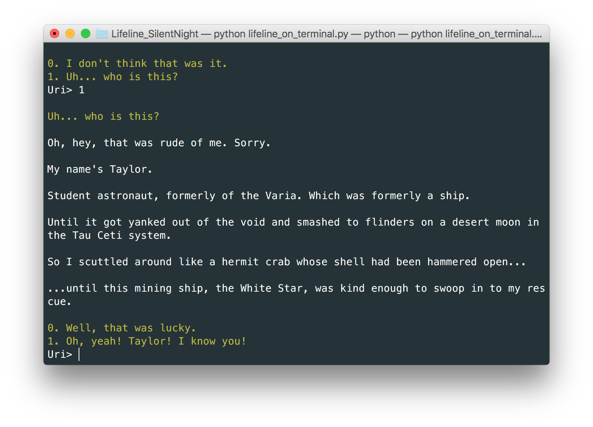

# Lifeline_SilentNight

[](https://github.com/Urinx/Lifeline_SilentNight/blob/master/LICENSE) 

`Lifeline: SilentNight` is now available on Telegram and terminal. You can experience a tense psychological thriller and save Taylor from the green aliens just as same as it's on iOS or Android.

> Language support: English, Deutsch, Français, Русский, 日本語, 中文


## Telegram

If you want to play lifeline game on the telegram, just add the bot count `@LifelineSilentNightBot`. That's all.


## Terminal

Also, you can play this game just on terminal. Note that it requires Python environment.

```bash
python3 lifeline_on_terminal.py
```



## Deployment

What's the most import thing is that all these are open source. You can modify the code and build your lifeline telegram bot on your own server.

Before you run the program, one more thing needs your attention. For this program is using telegram bot API based on [python-telegram-bot](https://github.com/python-telegram-bot/python-telegram-bot) package, you need install the package first.

```bash
pip3 install python-telegram-bot
```

> If you're not familiar with python-telegram-bot, the example `telegram_bot_demo.py` can help you, it's easy and short and covers the basic APIs.

And then, replace the bot token you get from the @BotFather, now you can start your lifeline telegram bot on server.

```bash
python3 lifeline_on_telegram.py
```

## What's more

I know, there's still much thing remaining to be done, such as playing on web or WeChat, even you can write a new story or script. I have a little time, so it's your turn. Just do it and bring Taylor home!


